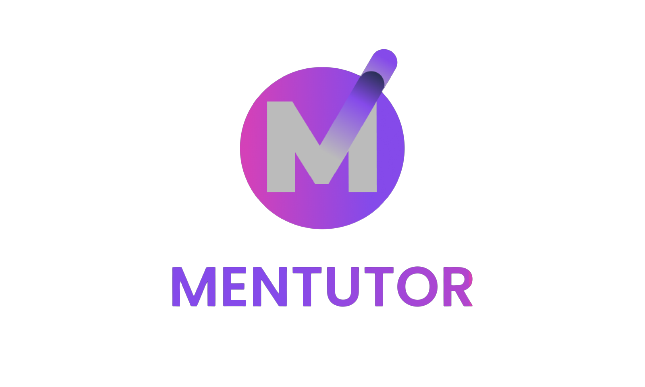

<div align="center">
  <h1>Welcome to Mentutor</h1>

<a href="">
    
  </a>

  <p align="center">
    WEB Testing with RestAssured and SerenityBDD
    <br />
    <a href="https://mentutor-immersive.vercel.app/"><strong>| MENTUTOR |</strong></a>
    <br />
    <br />
  </p>
</div>

## 📑 About the Project
### Application Under Test | Mentutor
<p align="justify">Welcome to our API Testing repository. Mentutor are present as a forum for teachers to monitor their students both from collection and by practicing with students through the provided forum.

## 📑 API Testing- Mentutor
<p align="justify">This project was created to complete a Capstone project in the Batch 11 Quality Assurance class at the Alterra Academy Immersive Program. At this project, we perform an API Automation Testing for 3 users feature or end points (Admin, Mentor, and Mentee).</p>

## 📓 Documentation
#### 👀   [Test Run WEB](https://youtu.be/iaz8q6xAYts)
#### 📝   [Test Automation Report](https://github.com/Capstone-Mentutor-Group4/QE-WEB-Mentutor.git)


## 🛠 Tools
**Manual:**


**Automation:**


**Framework for automation:**


**Test Case Management:**

[](https://docs.google.com/spreadsheets/d/16WhgJEVnogjZcaBX8dx-v-t7AyZ3uNrFrAytvRM3Gfg/edit#gid=636697585)

**Project Management:**

[](https://trello.com/b/L3cmVsCq)

**Communication:**


### 💫 Tested Feature Coverage

## Web Overview


## Summary Report


## Test Documentation Spreadsheet


## Automation Testing When Run in Intellij IDE


## 🏎️ How to Run all Test Scenarios

This is an example of how you may give instructions on setting up your project locally.
To get a local copy up and running follow these simple example steps.

### Prerequisites

- Java 1.8
- Maven
- Gherkin for Java
- Cucumber

### Installation

1. Clone the repository
```bash
$ git clone https://github.com/Capstone-Mentutor-Group4/QE-API-Mentutor.git
```
2. Open  this Project Repository on Intellij IDE and Run this on the IDE terminal
```bash
$ mvn clean verify
```

## 📱 Our teams

[](https://www.linkedin.com/in/rolando-tigor-b02565173)
[](https://github.com/tigorrr4/)

[](https://www.linkedin.com/in/mkhairul-fahmi-rasyidin-0723411ba)
[](https://github.com/sultanjoss/)

<h5>
<p align="center">:copyright: 2023 | This Repository Built with :heart: from Group-4</p>
</h5>
